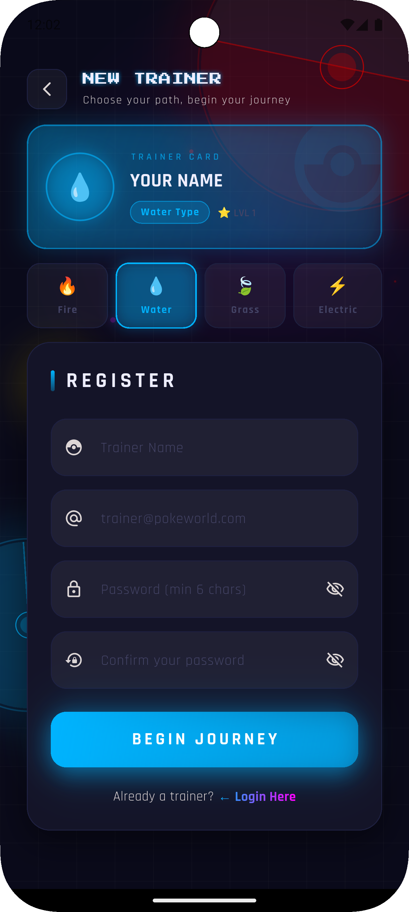
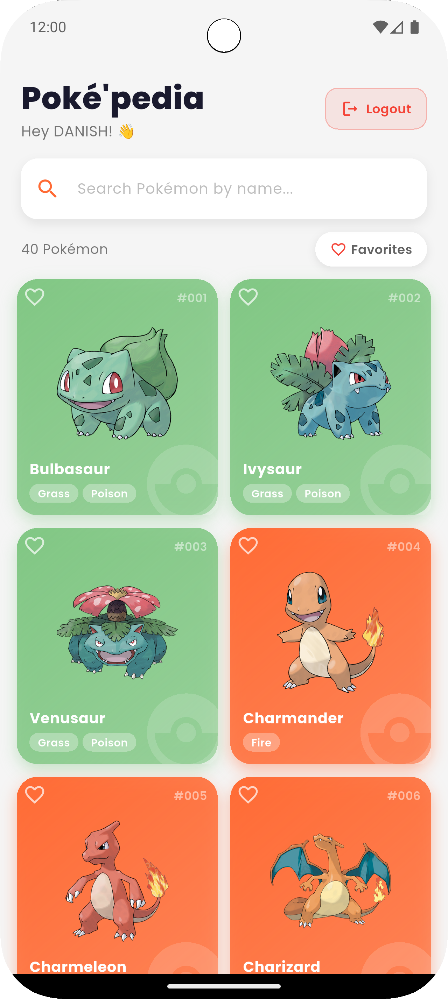
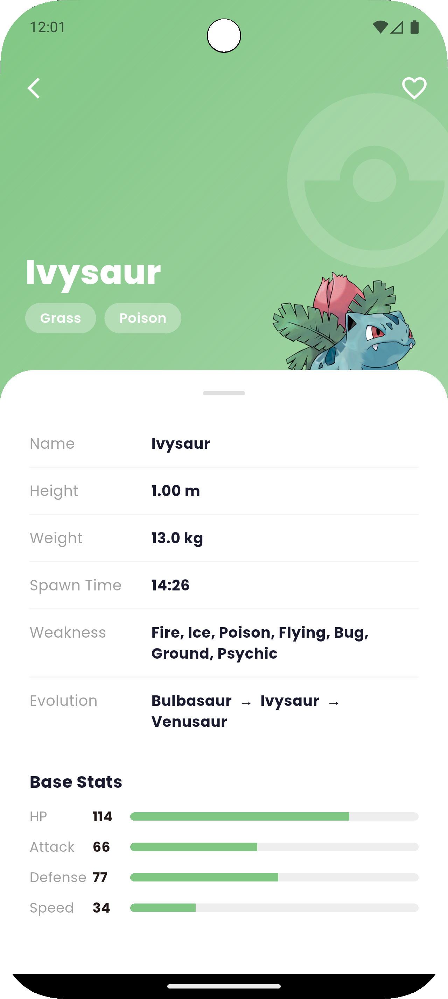
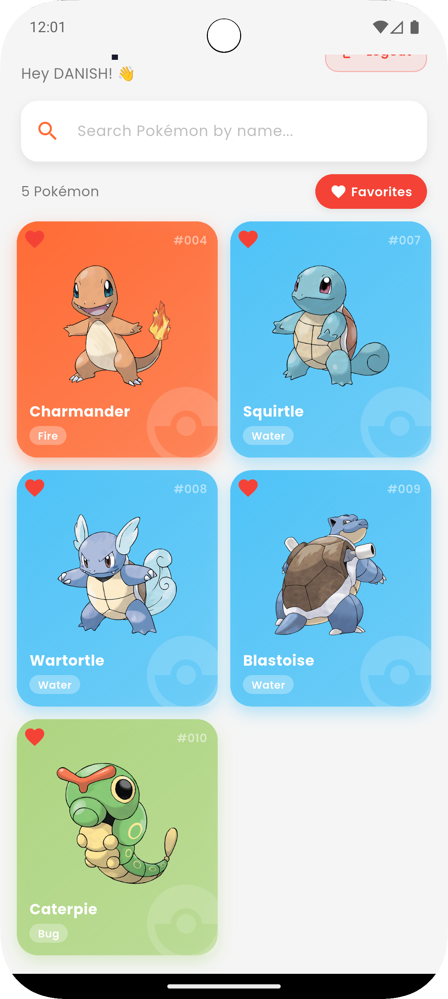

Poképedia – Pokémon Explorer App

Poképedia is a creative Flutter Pokédex app that allows users to explore Pokémon with a beautiful UI, smooth animations, and real-time data from PokéAPI.

🚀 Features Implemented

🎬 Login screen with Lottie animation

🔍 Pokémon list fetched from PokéAPI

🧾 Pokémon details screen

🎨 Creative card-based premium UI

⚡ Smooth animations and transitions

📱 Responsive layout

🧠 State management using setState()

🔎 Pokémon search (if implemented)

⭐ Favorite Pokémon (if implemented)

🧠 API Used

🐾 PokéAPI

https://pokeapi.co/api/v2/

📦 Packages Used
http:
lottie:
google_fonts:
flutter_spinkit:
shared_preferences:
📸 Screenshots
🔐 Login Screen

🏠 Pokémon List Screen

🛠️ Tech Stack

Flutter

Dart

REST API

Lottie Animations

▶️ Getting Started
flutter pub get
flutter run
🙌 Author

Mohd Danish

⭐ If you like this project, give it a star!
